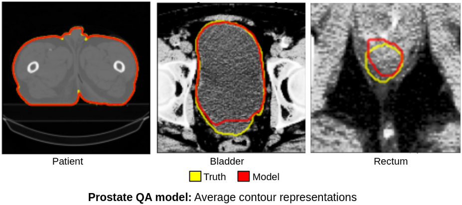
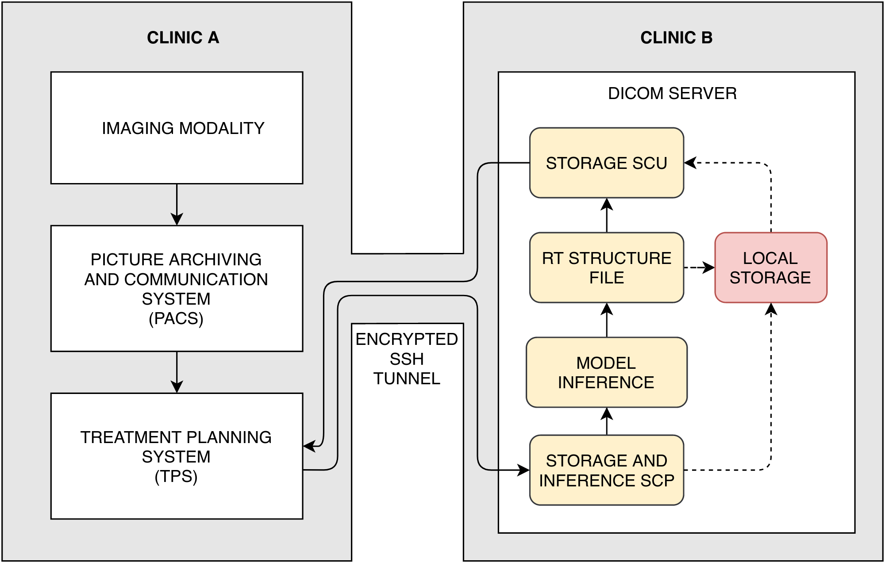

**This repository is currently a WORK IN PROGRESS**

<p align="center">
  
</p>

* The training pipeline assumes data is organised as in the test_dataset folder. The DataModule handles paths, which are read to arrays per batch for training.  
 
  The image file `test_dataset/<patient>/img/<array>.npy` matches with a mask `test_dataset/<patient>/mask/<array>.npy`, each with shape (1, 512, 512). Different grid sizes can be specified, however, this 2D implementation supports only 1 input channel.
  
* The inference pipeline assumes the data is a path to a directory containing a DICOM imaging series. Each image in a series will be converted to a array for inference.

## Setup

Activate a python virtual environment
```bash
python3 -m venv env
source env/bin/activate
```
Install requirements via pip
```bash
pip install --upgrade pip
pip install -r requirements.txt
```

## Training

PytorchLightning will handle saving the best model and its parameters, as well as logging to tensorboard by default.

Run the `train.py` file specifying any argument required. For example:
```bash
python train.py --batch_size=5 --gpus=1 --precision=16
```

Accepted arguments are outlined in `model2D.UNet`, `generator2D.DataModule`, and the pytorch_lightning `Trainer` module, [hyperlinked here](https://pytorch-lightning.readthedocs.io/en/stable/_modules/pytorch_lightning/trainer/trainer.html). The default dataset used is the `test_dataset` included in this repository - an open canine CT dataset with vacuum bags contoured for clinical radiotherapy. Other datasets can be specified as an argument above via `--data_dir`.

The following arguments can all be passed directly via the command line interface to `train.py` as shown above.

* Module: `generator2D.DataModule`  
Note the option to specify k-folding for each run.
```python
class DataModule(pl.LightningDataModule):
    @staticmethod
    def add_specific_args(parent_parser):
        parser = ArgumentParser(parents=[parent_parser], add_help=False)
        parser.add_argument("--data_dir", type=str, default="../test_dataset")
        parser.add_argument("--batch_size", type=int, default=5)
        parser.add_argument("--k_folds", type=int, default=5)
        parser.add_argument("--k_fold_index", type=int, default=0)
        parser.add_argument("--input_shape", type=tuple, default=(1, 512, 512))
        parser.add_argument("--num_workers", type=int, default=12)
        return parser
```


* Module: `model2D.UNet` 
```python
class UNet(pl.LightningModule):
    @staticmethod
    def add_specific_args(parent_parser):
        parser = ArgumentParser(parents=[parent_parser], add_help=False)
        parser.add_argument("--loss_function",type=str, default=F.binary_cross_entropy_with_logits)
        parser.add_argument("--optimizer", type=str, default=torch.optim.Adam)
        parser.add_argument("--encoder_args",type=tuple, default=(32, 64, 128, 256, 512, 1024)),
        parser.add_argument("--output_channels", type=int, default=1),
        parser.add_argument("--learning_rate", type=float, default=1e-3)
        return parser

```


## Deployment - via a DICOM server
Deployment is acheived via the DICOM networking protocol and can be initiated via the command:
```bash
python dicom_network_model_import_scp.py
```

* Module: `python dicom_network_model_import_scp` 
```python
    parser = argparse.ArgumentParser()
    parser.add_argument("--storage_path", type=str, default="dicom_storage_requests")
    parser.add_argument("--checkpoint_path", type=str, default="../test_model/checkpoint.ckpt")
    parser.add_argument("--scp_ip", type=str, default="127.0.0.1")
    parser.add_argument("--scp_port", type=int, default=11112)
    parser.add_argument("--scu_ip", type=str, default="127.0.0.1")
    parser.add_argument("--scu_port", type=int, default=11112)
    parser.add_argument("--root_uid", type=str, default="1.2.826.0.1.3680043.8.498.")
    parser.add_argument("--export_series", type=str, default="True")
    args = parser.parse_args()
```

`dicom_network_model_import_scp.py` is a DICOM service class provider (Storage and inference SCP) that will:
  1. Accept storage requests to `--storage_path` for a DICOM imaging series, for instance, exported from a treatment planning system to the SCP port `--scp_port` and SCP IP address `--scp_ip` 
  2. Produce inference from the model `--checkpoint_path`
  3. Create an RT Structure file (Currently only a single structure is supported - "Vacbag", but this will change soon!)
  4. Call `dicom_network_model_export_scu.py`, a service class user (Storage SCU) that requests a C-STORE of the structure file to export inferred contours (and the imaging series if flagged `--export_series`) back to the treatment planning system (or to any other SCU port `--scu_port` and SCU IP address `--scu_ip`)

This networking protocol can be applied between multiple clinics via ssh - as drawn below; or, within a single clinic via a localhost address

<p align="center">
  
</p>

An end-to-end network test can be acheived by simulating export from the TPS via the `dicom_network_tps_export_scu.py` file
